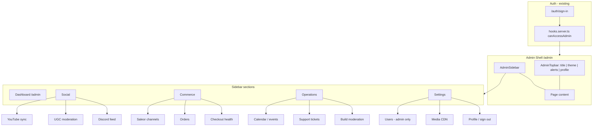

**Status:** Complete  
**Archived:** 2026-06-30  
**See instead:** in-repo `/admin` (`src/routes/admin/`) · [STATUS.md](../STATUS.md)

# Dashboard Adoption Plan

Living memory for adopting UI patterns from [robbins23/daisyui-admin-dashboard-template](https://github.com/robbins23/daisyui-admin-dashboard-template) (DashWind) into Animal Garage's SvelteKit admin surface.

**Last audited:** 2026-06-29  
**Template live preview:** [tailwind-dashboard-template-dashwind.vercel.app](https://tailwind-dashboard-template-dashwind.vercel.app/)

---

## 1. Template repo audit

### Stack

| Layer     | Template                                           | Animal Garage (today)                                                           |
| --------- | -------------------------------------------------- | ------------------------------------------------------------------------------- |
| Framework | React 18 + CRA                                     | SvelteKit 2 + Svelte 5                                                          |
| Styling   | Tailwind CSS 3.3 + **daisyUI 4.4**                 | Tailwind CSS 4 (Vite plugin) — **daisyUI install in progress** (parallel agent) |
| Routing   | React Router 6 (`/app/*` protected shell)          | File-based `src/routes/admin/*`                                                 |
| State     | Redux Toolkit (header, modal, right drawer, leads) | Svelte stores / `$state` / server loads                                         |
| Charts    | Chart.js 2 + react-chartjs-2                       | None in admin                                                                   |
| Icons     | Heroicons 2 (outline)                              | Inline SVG / text labels                                                        |
| Dates     | dayjs + moment                                     | Native `Date` / ISO strings                                                     |
| HTTP      | axios + Bearer token in `localStorage`             | SvelteKit `load` / `actions`, Supabase SSR                                      |
| Auth      | **Client-only** `localStorage.token` gate          | **Server** Supabase session + `canAccessAdmin` in `hooks.server.ts`             |

### Layout patterns (worth porting)

1. **Drawer shell** — `drawer lg:drawer-open` with checkbox toggle; sidebar `w-80 menu`; content area scrolls independently (`containers/Layout.js`, `PageContent.js`).
2. **Sticky topbar** — `navbar` with mobile hamburger, dynamic `pageTitle`, theme swap, notification bell, profile dropdown (`containers/Header.js`).
3. **Collapsible sidebar submenus** — `SidebarSubmenu` for Settings, Documentation (`routes/sidebar.js`).
4. **Right drawer** — Secondary panel for notifications, calendar day detail, lead preview (`RightSidebar.js`, `rightDrawerSlice.js`).
5. **Global modal** — Confirmation / add-lead via `ModalLayout` + `modalSlice.js`.
6. **Title cards** — `components/Cards/TitleCard.js` wraps page sections.
7. **Form primitives** — `InputText`, `SelectBox`, `TextAreaInput`, `SearchBar`, `ToggleInput`.
8. **Calendar** — Custom `CalendarView` + right-drawer day detail (`features/calendar/`).
9. **Stats grid** — `DashboardStats`, `AmountStats`, `PageStats` on home dashboard.
10. **Tables + CRUD pages** — Leads, Transactions, Team, Bills as list/detail patterns.

### daisyUI components used heavily

`drawer`, `menu`, `navbar`, `btn`, `badge`, `dropdown`, `swap` (theme), `select`, `modal`, `table`, `card`, `indicator`, `avatar`, `divider`, `checkbox`, `input`, `textarea`, `alert`.

Theme switching via `theme-change` + `data-theme` on `<html>`; themes `light` / `dark` in `tailwind.config.js`.

### Auth approach (template — do **not** copy)

```javascript
// src/app/auth.js — localStorage token, redirect to /login
const TOKEN = localStorage.getItem('token');
if (!TOKEN && !isPublicPage) window.location.href = '/login';
axios.defaults.headers.common['Authorization'] = `Bearer ${TOKEN}`;
```

Public routes: `/login`, `/register`, `/forgot-password`, `/documentation`. Protected shell: `/app/*` → `Layout`. Login page sets token in localStorage (demo only).

**Animal Garage already has a stronger model:** Supabase session in `hooks.server.ts`, role from `raw_app_meta_data`, `DEV_ADMIN` escape hatch, redirect to `/auth/sign-in?redirect=…`.

### Routing structure (template)

```
/login, /register, /forgot-password, /documentation   (no shell)
/app/*                                                   (Layout shell)
  /app/welcome, /app/dashboard
  /app/leads, /app/transactions, /app/charts, /app/integration, /app/calendar
  /app/settings-profile, /app/settings-billing, /app/settings-team
  /app/getting-started, /app/features, /app/components
  /app/blank, /app/404
```

Sidebar config is decoupled in `src/routes/sidebar.js`; page routes in `src/routes/index.js`.

### What we skip from the template

- Redux Toolkit → use SvelteKit loads + minimal `$state` / context where needed.
- CRA / React → no port of components verbatim; **translate patterns** to Svelte.
- axios + localStorage auth → keep Supabase SSR.
- `react-notifications` → Svelte toast/snackbar (or daisyUI `toast` once installed).
- Duplicate date libs (moment + dayjs) → pick one (`dayjs`) if calendar ships.

---

## 2. Monorepo `/admin` vs git submodule

### Option A — In-repo `/admin` extension (recommended default)

Extend existing `src/routes/admin/*` with a dashboard shell, shared `$lib/components/admin/*`, and server modules under `$lib/server/`.

| Pros                                                         | Cons                                                                |
| ------------------------------------------------------------ | ------------------------------------------------------------------- |
| Single deploy, shared auth/session/types/env                 | Admin UI ships with storefront bundle (mitigate via code-splitting) |
| Reuse `canAccessAdmin`, Saleor client, Supabase admin client | Must isolate layout from storefront Header/Footer (route group)     |
| Same CI, same Tailwind/daisyUI config                        | Template is React — manual Svelte translation                       |
| Fits current Phase 3 work (`/admin/youtube`, users, media)   |                                                                     |

### Option B — Git submodule (separate dashboard repo)

| Pros                            | Cons                                                       |
| ------------------------------- | ---------------------------------------------------------- |
| Independent release cadence     | Two auth systems or shared cookie domain complexity        |
| Could fork DashWind React as-is | Stack mismatch (React vs SvelteKit) unless rewritten       |
| Smaller storefront bundle       | Duplicate env, types, API clients; CORS if separate origin |
|                                 | Submodule DX pain (pinning, CI checkout, drift)            |

### Recommendation

**Default: in-repo `/admin` extension** under a route group `(dashboard)` with its own layout shell. Complexity does not yet warrant a submodule — we have 4 admin pages, one auth pipeline, and tight Saleor/Supabase coupling.

Consider a submodule **only if** a dedicated team ships a separate React admin on another domain with its own auth broker. That is not the current trajectory.

> **Submodule approval:** If requirements change (standalone admin product, separate team, different framework), **ask the user for explicit approval** before adding a git submodule.

---

## 3. Auth gate (reuse existing)

### Current implementation

| Piece                               | Path                                                                                   |
| ----------------------------------- | -------------------------------------------------------------------------------------- |
| Role definitions + `canAccessAdmin` | `src/lib/auth/roles.ts` → re-exported `src/lib/server/auth/roles.ts`                   |
| Server hook gate                    | `src/hooks.server.ts` — `/admin` prefix → `devAdmin \|\| canAccessAdmin(session.role)` |
| Sign-in redirect                    | `/auth/sign-in?redirect=${pathname}`                                                   |
| Session load                        | `src/lib/server/supabase/auth.ts` (`getSession`)                                       |
| Layout session data                 | `src/routes/admin/+layout.server.ts`                                                   |

### Access matrix

| Role          | Admin panel                                                |
| ------------- | ---------------------------------------------------------- |
| `admin`       | Full (users, settings, all modules)                        |
| `editor`      | Content/media/social/commerce read; **no** user role admin |
| `contributor` | No admin (build submit only)                               |
| `customer`    | No admin                                                   |

`DEV_ADMIN=true` grants access without role (local dev only).

### Phase 1 additions (no new auth system)

1. **Fine-grained route guards** in `+page.server.ts` / `+layout.server.ts` per module, e.g. `hasRole(session.role, 'admin')` for `/admin/users`.
2. **Pass `session` + `pageTitle`** from admin layout server load for topbar.
3. **Do not** add localStorage token checks or parallel login pages — storefront `/auth/sign-in` remains the only gate.
4. **Service role** for moderation tables (`build_submissions`) via `createAdminClient()` — already used in `src/lib/server/forms/submit.ts`.

---

## 4. Module map (dashboard MVP)

### 4.1 Social channels

| Submodule    | Today                                                            | Target                                                                           | Primary paths                                                                                            |
| ------------ | ---------------------------------------------------------------- | -------------------------------------------------------------------------------- | -------------------------------------------------------------------------------------------------------- |
| **YouTube**  | Mock channels, sync stub, admin UI                               | Supabase `youtube_channels` + `videos` upsert; cron                              | `src/lib/server/youtube/sync.ts`, `src/routes/admin/youtube/`                                            |
| **UGC wall** | `mockUGC` on homepage                                            | Moderation queue: approve/reject, link to products                               | `src/lib/data/mock/ugc.ts` → `supabase/migrations/*_ugc_submissions.sql`, `src/routes/admin/social/ugc/` |
| **Discord**  | OAuth sign-in only (`docs/auth/discord.md`); support CTA on site | **Phase 2:** webhook ingest for #support or bot events; display threads in admin | `src/routes/admin/social/discord/` (read-only mirror); no Discord admin API in MVP                       |

**YouTube** is the most mature — extend before UGC/Discord.

### 4.2 Saleor sales channels

| Submodule            | Today                                              | Target                                                   | Primary paths                                                                                          |
| -------------------- | -------------------------------------------------- | -------------------------------------------------------- | ------------------------------------------------------------------------------------------------------ |
| **Channel overview** | `getChannelForLocale` maps locale → `us`/`eu`/`jp` | Admin table: channel slug, currency, active, order count | `src/lib/server/saleor/channels.ts`, `src/routes/admin/commerce/channels/`                             |
| **Orders**           | `mock/orders.ts` on account page                   | Saleor GraphQL `orders` query filtered by channel        | `src/lib/data/mock/orders.ts` → `src/lib/server/saleor/orders.ts`, `src/routes/admin/commerce/orders/` |
| **Checkout health**  | Cookie checkout in `checkout.ts`                   | Dashboard widget: open checkouts, failed payments        | `src/lib/server/saleor/checkout.ts`                                                                    |

Saleor remains headless on `<your-saleor-host>`; admin only **reads** via GraphQL (mutations for catalog later).

### 4.3 Calendar (events + physical sales)

| Data                         | Recommendation                                              |
| ---------------------------- | ----------------------------------------------------------- |
| Track days, pop-ups, meetups | **Supabase `events` table** — editorial, not commerce SKUs  |
| Sale-linked drops            | Optional `saleor_promotion_id` metadata column on event row |
| Storefront                   | Keep `mock/events.ts` API shape; swap loader to Supabase    |

**Why not Saleor for calendar?** Events are marketing/ops entities; Saleor has no first-class calendar. Use Saleor only for tying a drop to a product/collection.

| Path                                | Purpose                                                     |
| ----------------------------------- | ----------------------------------------------------------- |
| `supabase/migrations/*_events.sql`  | `events` table + RLS (public read, editor write)            |
| `src/lib/server/events/`            | CRUD helpers                                                |
| `src/routes/admin/calendar/`        | Month view (port template `CalendarView` pattern to Svelte) |
| `src/routes/events/+page.server.ts` | Public list from Supabase                                   |

### 4.4 Customer support ticketing

| Option                                           | Fit                                                                                |
| ------------------------------------------------ | ---------------------------------------------------------------------------------- |
| **Supabase `support_tickets`** (recommended MVP) | Contact form + account messages; full control; matches `build_submissions` pattern |
| External (Zendesk, Plain, Discord)               | Defer until volume warrants                                                        |

Proposed schema: `id`, `user_id`, `email`, `subject`, `body`, `status` (`open`/`pending`/`resolved`), `assigned_to`, `source` (`contact`/`discord`/`order`), `created_at`.

| Path                                        | Purpose                                        |
| ------------------------------------------- | ---------------------------------------------- |
| `supabase/migrations/*_support_tickets.sql` | Table + RLS                                    |
| `src/lib/server/support/`                   | Create from contact form; admin list/update    |
| `src/routes/admin/support/`                 | Ticket inbox (template **Leads** page pattern) |

---

## 5. Phased rollout

### Prerequisite (parallel agent)

- Install **daisyUI** for Tailwind 4 + register themes (`dark` aligned with AG zinc/red brand).
- Reference: template `tailwind.config.js` plugins + `theme-change` optional.

### Phase 1 — Shell + layout isolation (1–2 days)

**Goal:** Dashboard chrome without storefront Header/Footer; nav skeleton for all MVP modules.

| Action                                            | Files                                                                                                                                                                               |
| ------------------------------------------------- | ----------------------------------------------------------------------------------------------------------------------------------------------------------------------------------- |
| Route group: isolate admin from storefront chrome | `src/routes/+layout.svelte` (minimal root) → `src/routes/(storefront)/+layout.svelte` (Header/Footer) + move public routes; **or** interim `src/routes/admin/+layout@.svelte` reset |
| Dashboard shell (drawer + topbar)                 | `src/routes/admin/+layout.svelte`, `src/lib/components/admin/AdminSidebar.svelte`, `src/lib/components/admin/AdminTopbar.svelte`                                                    |
| Nav config (data-driven, like `sidebar.js`)       | `src/lib/admin/nav.ts`                                                                                                                                                              |
| Page title helper                                 | `src/lib/admin/page-title.ts` + set in child `+page.svelte` or load                                                                                                                 |
| Upgrade home dashboard stats                      | `src/routes/admin/+page.svelte`                                                                                                                                                     |
| Role guard on users                               | `src/routes/admin/users/+page.server.ts` — `hasRole(..., 'admin')`                                                                                                                  |

### Phase 2 — Core ops modules (3–5 days)

| Module             | Files to create                                                                                     |
| ------------------ | --------------------------------------------------------------------------------------------------- |
| YouTube → Supabase | `supabase/migrations/*_youtube_channels.sql`, extend `sync.ts`, update `admin/youtube/`             |
| Build moderation   | `src/routes/admin/moderation/builds/+page.server.ts`, reuse `build_submissions`                     |
| UGC moderation     | `supabase/migrations/*_ugc_submissions.sql`, `src/routes/admin/social/ugc/`                         |
| Support inbox      | `supabase/migrations/*_support_tickets.sql`, `src/lib/server/support/`, `src/routes/admin/support/` |
| Shared admin UI    | `src/lib/components/admin/DataTable.svelte`, `TitleCard.svelte`, `StatCard.svelte`                  |

### Phase 3 — Commerce + calendar + analytics (5+ days)

| Module                    | Files to create                                                                                                                            |
| ------------------------- | ------------------------------------------------------------------------------------------------------------------------------------------ |
| Saleor channels + orders  | `src/lib/server/saleor/orders.ts`, `src/routes/admin/commerce/channels/`, `.../orders/`                                                    |
| Events calendar           | `supabase/migrations/*_events.sql`, `src/lib/server/events/`, `src/routes/admin/calendar/`, `src/lib/components/admin/CalendarView.svelte` |
| Discord mirror (optional) | `src/routes/admin/social/discord/` + webhook API route                                                                                     |
| Dashboard charts          | `src/lib/components/admin/charts/` (Chart.js or layerchart) — template `Dashboard` widgets                                                 |
| Notifications             | `src/lib/components/admin/NotificationDrawer.svelte` (port right-drawer pattern)                                                           |

---

## 6. Wireframe — dashboard IA



---

## 7. What we have today vs gaps

| Area               | Have today                                              | Gap                                                 |
| ------------------ | ------------------------------------------------------- | --------------------------------------------------- |
| **Auth gate**      | `hooks.server.ts` + `canAccessAdmin` + `DEV_ADMIN`      | Per-route `admin`-only guards (users page)          |
| **Admin routes**   | `/admin`, `/users`, `/media`, `/youtube`                | Commerce, calendar, support, social/UGC, moderation |
| **Admin layout**   | Basic zinc sidebar; **inside storefront Header/Footer** | Route group isolation; daisyUI drawer shell; topbar |
| **daisyUI**        | Not installed                                           | Parallel agent; then swap utility classes           |
| **YouTube**        | `sync.ts` stub, admin forms, mock channels              | Real API, Supabase persistence, cron                |
| **UGC**            | `mockUGC` display only                                  | Submission + moderation pipeline                    |
| **Discord**        | OAuth login                                             | No admin/support integration                        |
| **Saleor**         | Client, channels map, checkout cookie                   | Admin order list, channel dashboard                 |
| **Orders**         | `mock/orders.ts`                                        | Saleor GraphQL-backed admin view                    |
| **Events**         | `mock/events.ts`                                        | Supabase `events` + admin calendar                  |
| **Support**        | Contact form UI (stub submit)                           | `support_tickets` table + admin inbox               |
| **Builds**         | `build_submissions` migration + submit action           | Admin moderation UI                                 |
| **Users**          | Mock client-side CRUD                                   | Supabase profiles + service-role role updates       |
| **Media**          | Mock catalog page                                       | CDN upload integration                              |
| **Charts / stats** | Static stat cards on dashboard                          | Live metrics from Saleor/Supabase                   |
| **Notifications**  | None                                                    | Right-drawer pattern from template                  |
| **Theme toggle**   | Storefront dark zinc only                               | Admin theme swap via daisyUI `data-theme`           |

---

## 8. Template → Svelte translation cheatsheet

| Template (React)                  | Animal Garage (SvelteKit)                       |
| --------------------------------- | ----------------------------------------------- |
| `routes/sidebar.js`               | `src/lib/admin/nav.ts`                          |
| `containers/Layout.js`            | `src/routes/admin/+layout.svelte`               |
| `containers/Header.js`            | `src/lib/components/admin/AdminTopbar.svelte`   |
| `containers/LeftSidebar.js`       | `src/lib/components/admin/AdminSidebar.svelte`  |
| `containers/RightSidebar.js`      | `src/lib/components/admin/AdminDrawer.svelte`   |
| `features/leads/index.js`         | `src/routes/admin/support/+page.svelte`         |
| `pages/protected/Calendar.js`     | `src/routes/admin/calendar/+page.svelte`        |
| `pages/protected/Transactions.js` | `src/routes/admin/commerce/orders/+page.svelte` |
| `pages/protected/Team.js`         | `src/routes/admin/users/+page.svelte`           |
| `redux headerSlice pageTitle`     | `+page` data or `setContext('adminTitle')`      |

---

## 9. Open decisions

1. **Route group migration** — Moving storefront routes under `(storefront)/` is a large diff; acceptable in Phase 1 or defer with `+layout@` interim?
2. **Chart library** — Chart.js (template parity) vs lighter Svelte-native option.
3. **Discord admin** — Webhook-only mirror vs full bot.
4. **Support tool** — Supabase-native vs external when volume grows.

---

## 10. Submodule decision (summary)

**Recommend in-repo `/admin` extension.** No submodule unless the product splits into a separate admin app with independent deployment — **ask user before submodule**.

---

_Related docs:_ [phase3-plan.md](./phase3-plan.md), [commerce/saleor.md](../commerce/saleor.md), [integrations/supabase.md](../integrations/supabase.md), [auth/oauth.md](../auth/oauth.md), [content/build-submissions.md](../content/build-submissions.md)
