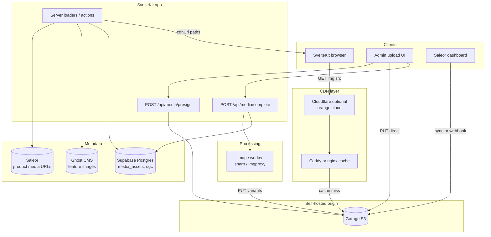
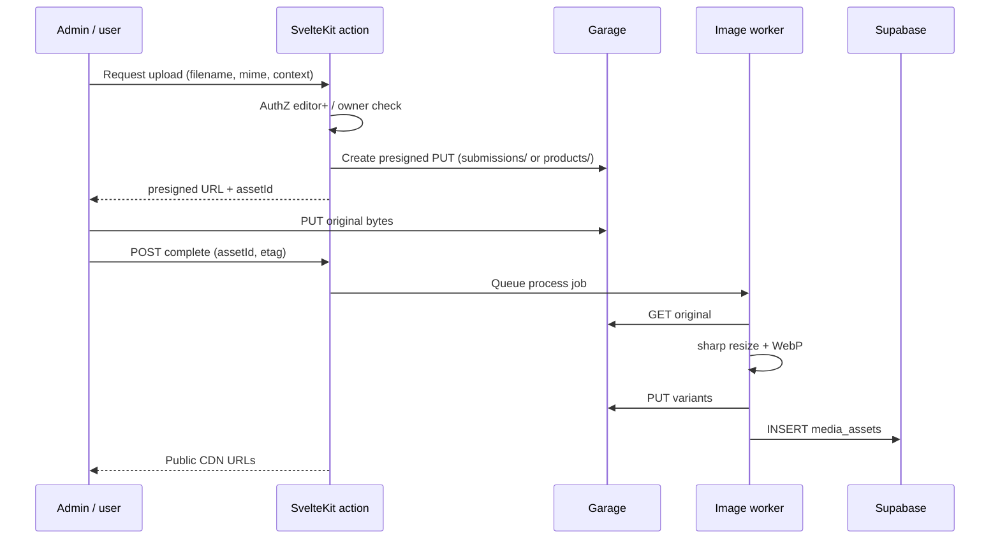

**Status:** Superseded  
**Archived:** 2026-06-30  
**See instead:** [plans/active/media-uploads.md](../plans/active/media-uploads.md) (phase 1) · [infrastructure/overview.md](../infrastructure/overview.md)

# Media & Image Hosting Plan

Planning document for hosting hundreds to thousands of images on Animal Garage using **self-hosted S3-compatible object storage** (Garage) behind a **caching CDN**. No infrastructure is implemented yet — this doc informed Phase 3 and superseded the AWS-centric sketches in [infrastructure/overview.md](../infrastructure/overview.md) where they conflict.

**Related docs:** [style-guide/frontend/media.md](../style-guide/frontend/media.md), [style-guide/backend-ops/cdn-media.md](../style-guide/backend-ops/cdn-media.md), [infrastructure/overview.md](../infrastructure/overview.md), [commerce/saleor.md](../commerce/saleor.md), [content/ghost.md](../content/ghost.md), [integrations/supabase.md](../integrations/supabase.md), [content/build-submissions.md](../content/build-submissions.md)

---

> **Note:** Examples use placeholders only — not production infrastructure. See [SECURITY-PUBLIC.md](../SECURITY-PUBLIC.md).

## Executive summary

Animal Garage today serves almost all imagery from **picsum.photos** placeholders in mock data, with `PUBLIC_CDN_BASE_URL` scaffolded but unused. Production commerce images will ultimately come from **Saleor** (URL passthrough); editorial heroes from **Ghost**; community and brand media from **our own bucket**.

**Recommendation:** Deploy **[Garage](https://garagehq.deuxfleurs.fr/)** as the S3-compatible origin (fits the “garage S3” intent — lightweight, self-hosted, geo-replicable), front it with **Caddy or nginx** as a reverse proxy + cache layer, and optionally put **Cloudflare** in front for global edge caching and TLS. Generate **content-addressed variants on upload** (WebP/AVIF + fixed widths); avoid on-the-fly image resizing in v1. Keep **Supabase for metadata and auth**, not binary storage. Expose a single public base URL via `PUBLIC_CDN_BASE_URL=https://<your-cdn-host>`.

Phased rollout: (1) static marketing + admin upload path, (2) Saleor product sync, (3) UGC and build-submission photos.

---

## Current state

### How images are used today

| Surface | Domain type | Source today | Components / routes |
|--------|-------------|--------------|---------------------|
| Shop & parts catalog | `Product.thumbnail`, `Product.media[]` | picsum in `mock/products.ts`, `mock/parts.ts`; Saleor mapper passes URLs through | `ProductCard`, `CartDrawer`, `parts/[slug]`, `shop/[slug]` |
| Collections | `backgroundImage.url` | picsum in `mock/collections.ts` | `CollectionCard`, shop filters |
| Brand pages | `logoUrl`, `heroImage` | picsum in `mock/brands.ts` | `BrandCard`, `/brands` |
| Homepage hero | campaign / fallback URL | picsum in `Hero.svelte` | `Hero.svelte`, `mock/campaigns.ts` |
| Builds gallery | `BuildThread.photos[]` | picsum in `mock/builds.ts` | `/builds`, `BuildCard` |
| Build submissions | *(no photos yet)* | text-only in Supabase `build_submissions` | `BuildLogForm.svelte`, `/builds/submit` |
| UGC wall | `UGCItem.image` | picsum in `mock/ugc.ts` | `UGCWall.svelte`, `/media` tab |
| Media gallery | `MediaItem.thumbnail`, `.src` | picsum in `mock/media.ts` | `MediaGallery.svelte`, `/media` |
| Watch / videos | `Video.thumbnail` | picsum in mock; YouTube sync stores external URL | `VideoCard`, `VideoHero`, `youtube/sync.ts` |
| Guides & blog | `heroImage` | Ghost `feature_image` or picsum fallback | `GuideCard`, `/guides`, `/blog` |
| Events | `imageUrl` | picsum in `mock/events.ts` | `EventsCalendar` |
| Popular models | `heroImage` | picsum in `mock/popular-models.ts` | `ModelPicker` |
| Part categories | `imageUrl` | picsum in `mock/part-categories.ts` | `PartCategoryNav`, mega-menu |
| About / static | inline picsum | hardcoded in `about/+page.svelte` | marketing pages |
| Admin media UI | preview only | mock list + upload stub | `/admin/media` |

### Data model (image fields)

From `src/lib/types/domain.ts` and `src/lib/types/saleor.ts`:

- **Commerce:** `ProductMedia { id, url, alt, type }` — thumbnail + gallery array; Saleor is source of truth when live.
- **Editorial:** `Guide.heroImage`, `BlogPost.heroImage` — string URLs from Ghost.
- **Community:** `BuildThread.photos[]`, `UGCItem.image` — plain string URLs today.
- **Brand/marketing:** `Brand.logoUrl`, `Brand.heroImage`, `Campaign.heroImage`, `Event.imageUrl`, `PopularModel.heroImage`.

No shared `ImageSet` or srcset type exists yet; everything is a single URL string or `ProductMedia.url`.

### External integrations

| System | Image role | Storage owner |
|--------|------------|---------------|
| **Saleor** | Product thumbnails + gallery | Saleor dashboard upload → Saleor storage or custom S3 backend; storefront reads `thumbnail.url` / `media[].url` via GraphQL ([mappers.ts](../src/lib/server/saleor/mappers.ts)) |
| **Ghost** | Feature images + inline HTML `` in post body | Ghost(Pro) CDN or self-hosted Ghost `content/images/`; mapped to `heroImage` ([ghost/mappers.ts](../src/lib/server/ghost/mappers.ts)) |
| **YouTube** | Video posters | `i.ytimg.com` — keep external; no need to mirror unless branding requires |
| **Supabase** | Auth, `build_submissions`, future `media_assets` metadata | **No Storage buckets in use** — see [integrations/supabase.md](../integrations/supabase.md) |

### Prototype configuration

```typescript
// src/lib/config/env.ts
cdnBaseUrl: env.PUBLIC_CDN_BASE_URL ?? ''
```

`.env.example` already defines `PUBLIC_CDN_BASE_URL`, `S3_BUCKET`, `S3_REGION`, and AWS keys (legacy naming from AWS-first plan). `/admin/media` simulates upload and previews `<your-cdn-host>/media/{id}` paths.

### Placeholder pattern

```typescript
const img = (seed: string, w = 800, h = 800) =>
  `https://picsum.photos/seed/${seed}/${w}/${h}`;
```

Documented in [style-guide/frontend/media.md](./style-guide/frontend/media.md). Deterministic seeds keep dev stable but are unsuitable for production (third-party dependency, no alt control, no variants).

---

## Scale estimate

### Mock catalog (today)

| Asset class | Count | Image refs (approx.) | Notes |
|-------------|------:|---------------------:|-------|
| Shop products | 120 | 360 | 1 thumb + 2 gallery per SKU |
| Parts SKUs | 727 | 2,181 | padded catalog (~20 per leaf category) |
| Builds | 12 | 34 | 2–4 photos each |
| UGC items | 12 | 12 | square thumbs |
| Videos (mock) | 12 | 12 | 640×360 thumbs |
| Brands | 10 | 20 | logo + hero |
| Collections | 13 | 13 | background each |
| Events | 6 | 6 | |
| Guides / blog (mock) | 14 | 14 | hero each |
| Media gallery items | 6 | 12 | thumb + full |
| Part categories | 9+ | ~15 | nav / mega-menu |
| **Mock subtotal** | **~900 entities** | **~2,700 URL refs** | all picsum |

### Production targets (12–24 months)

| Asset class | Low | High | Variant multiplier |
|-------------|----:|-----:|-------------------|
| Product + parts SKUs | 500 | 3,000 | ×4 variants (original + 3 widths/formats) |
| SKU image files | 1,500 | 9,000 | 3 source images/SKU avg |
| **Derived variants** | **6,000** | **36,000** | after WebP + widths |
| Brand / campaign / event heroes | 50 | 200 | ×3 variants |
| Build photos (approved) | 100 | 2,000 | user growth |
| UGC | 50 | 5,000 | moderation-gated |
| CMS (Ghost) heroes | 20 | 200 | may stay on Ghost CDN |
| Admin / static | 20 | 100 | logos, OG images |

**Storage (rough):** assume 400 KB average per master JPEG → 3,000 masters ≈ **1.2 GB**; with variants ≈ **3–5 GB**. UGC at scale could add **10–50 GB**. Well within a single Garage node or small cluster.

**Egress:** product listing pages dominate (thumb-heavy). CDN cache hit ratio target **>90%** after warm-up.

---

## Target architecture



**Read path:** Browser requests `https://<your-cdn-host>/...` → edge cache → Garage on miss.

**Write path:** Authenticated admin (or server action) obtains presigned PUT → uploads master → worker generates variants → metadata row in Supabase → optional Saleor media attach.

---

## Storage + CDN choices

### Object storage (recommendation: **Garage**)

| Option | Pros | Cons | Fit for AG |
|--------|------|------|------------|
| **[Garage](https://garagehq.deuxfleurs.fr/)** | Lightweight binary; S3 API; geo-replication; runs on modest hardware; AGPL | No versioning; simpler IAM; not for extreme QPS | **Primary recommendation** — matches self-hosted “garage S3” goal |
| **MinIO** | Mature S3 parity; broad tooling; erasure coding | Heavier ops; JVM/resource hunger vs Garage | Good if team already runs MinIO |
| **SeaweedFS** | Fast filer + S3; good for many small files | More moving parts (master/volume/filer) | Consider if mixing POSIX + S3 |
| **AWS S3** | Managed durability; native CloudFront OAC | Vendor lock-in; cost at scale; conflicts with self-host goal | Fallback / hybrid for prod-only backup |

**Deployment sketch (Garage):**

- **Dev:** single-node Garage (`garage server --single-node`) on Docker Compose alongside Caddy.
- **Prod:** 3 nodes, replication factor 3, one bucket `<media-bucket>` (or per-env buckets `<media-bucket-prod>`, `<media-bucket-staging>`).
- **Access:** S3 API keys per workload (storefront read-only, admin write, worker write, Saleor plugin).

### CDN / cache layer (recommendation: **Caddy + optional Cloudflare**)

| Layer | Role | Notes |
|-------|------|-------|
| **Caddy** (or nginx) | Reverse proxy to Garage; `cache` directive or `proxy_cache`; TLS for `<your-cdn-host>` | Same host or small VPS in front of Garage; full control |
| **Cloudflare** (optional) | Global edge, DDoS, free tier cache | Orange-cloud `<your-cdn-host>`; origin = Caddy; cache everything for `/products/*`, `/ugc/*` |
| **CloudFront** | AWS-native | Keep as doc-only alternative per [infrastructure/overview.md](../infrastructure/overview.md) if stack moves to AWS |

**Why not Garage alone?** Garage serves S3 objects but does not provide aggressive HTTP caching, image optimization, or geographic edge POPs. A dedicated cache tier is required for storefront performance.

---

## Bucket / key conventions

Single bucket with **prefix-based layout** (S3 “folders”). Use **immutable keys** for catalog (hash in path); **mutable keys** only where in-place updates are required (rare).

```
s3://<media-bucket>/
├── env/                          # optional: prod/ vs staging/ prefix
│   └── prod/
├── static/                       # long-lived brand assets (logos, OG)
│   └── brand/{slug}/logo.webp
├── products/
│   └── {channel}/{slug}/         # channel = us | eu | default
│       └── {contentHash}/
│           ├── original.jpg
│           ├── 400.webp
│           ├── 800.webp
│           └── 1200.webp
├── parts/
│   └── {categorySlug}/{slug}/{contentHash}/...
├── collections/
│   └── {slug}/{contentHash}/hero.webp
├── brands/
│   └── {slug}/logo.webp
│   └── {slug}/hero.webp
├── campaigns/
│   └── {id}/{contentHash}/hero.webp
├── events/
│   └── {slug}/{contentHash}/cover.webp
├── builds/
│   └── {slug}/{photoId}/{contentHash}.webp
├── ugc/
│   └── {year}/{month}/{id}/{contentHash}.webp
├── submissions/                  # quarantine before approval
│   └── {submissionId}/{contentHash}.jpg
└── media/                        # brand gallery (photos tab)
    └── {id}/{contentHash}/poster.webp
```

### Naming rules

| Rule | Example |
|------|---------|
| Slugs lowercase, hyphenated | `garage-flag-tee` |
| Content hash = SHA-256 first 12 chars of file bytes | `a3f9c2b1e8d0` |
| Public URL = `{CDN}/{prefix}/{...}` without bucket name | `https://<your-cdn-host>/products/us/garage-flag-tee/a3f9c2b1e8d0/800.webp` |
| Never overwrite catalog images — new hash = new URL | Enables `Cache-Control: immutable` |
| `photoId` / `id` = UUID from Supabase | stable gallery ordering |

### Environment separation

| Env | Bucket / prefix | CDN URL |
|-----|-----------------|---------|
| Local dev | MinIO/Garage Docker `ag-media-dev` or prefix `dev/` | `http://localhost:3900` or `http://cdn.localhost` |
| Staging | `<media-bucket-staging>` | `https://cdn.staging.animalgarage.net` |
| Production | `<media-bucket-prod>` | `https://<your-cdn-host>` |

---

## Image processing

### Recommendation: **on-upload** (not on-the-fly) for v1

| Approach | Pros | Cons | Phase |
|----------|------|------|-------|
| **On-upload (sharp in worker)** | Predictable cost; simple CDN; easy cache headers | Storage for variants; reprocess on format changes | **MVP** |
| On-the-fly (imgproxy / Thumbor) | Fewer stored files; arbitrary sizes | CPU on every cache miss; harder ops | Phase 2+ if needed |
| Saleor / Ghost native | Zero custom code | Less control over WebP/srcset | Use for commerce/CMS where possible |

### Variant set (v1)

| Name | Max width | Format | Use case |
|------|----------|--------|----------|
| `original` | as uploaded | JPEG/PNG | archive, zoom |
| `400` | 400px | WebP (+ AVIF optional) | cards, cart thumbs |
| `800` | 800px | WebP | product grid, UGC |
| `1200` | 1200px | WebP | PDP hero, build gallery |
| `1920` | 1920px | WebP | full-bleed heroes (optional) |

Generate AVIF only after WebP pipeline is stable (diminishing returns vs complexity).

### Upload pipeline



**Integrations:**

| Source | Upload entry | Notes |
|--------|--------------|-------|
| `/admin/media` | Presign action | Replace stub in [admin/media/+page.svelte](../src/routes/admin/media/+page.svelte) |
| Saleor | Saleor S3 plugin **or** sync job copying to Garage + URL rewrite in mapper | Prefer Saleor pointing at same Garage endpoint |
| Build submissions | New multi-file field on `/builds/submit` → `submissions/` quarantine | Moderation moves to `builds/` on approve |
| UGC | Moderated upload or Instagram-style submit | `ugc/` after approval |
| Ghost | Stay on Ghost CDN initially | Optional later: mirror heroes to `static/guides/` |

---

## Caching strategy

### Cache-Control by prefix

| Prefix | `Cache-Control` | Rationale |
|--------|-----------------|-----------|
| `products/`, `parts/` (hash in path) | `public, max-age=31536000, immutable` | URL changes when image changes |
| `ugc/`, `builds/` | `public, max-age=86400, stale-while-revalidate=604800` | may edit caption; photo rarely changes |
| `static/` | `public, max-age=2592000` | logos update infrequently |
| `submissions/` | `private, no-store` | not public until approved |

### CDN / proxy settings

- **Query strings:** ignore for cache key (no resize query params in v1).
- **CORS:** `Access-Control-Allow-Origin: https://animalgarage.net` (and staging).
- **Compression:** gzip/brotli at edge for non-image assets; images served as WebP/AVIF already compressed.

### Invalidation

| Scenario | Action |
|----------|--------|
| New product image (new hash) | **No invalidation** — new URL |
| Replace in-place (avoid) | Purge single path via Cloudflare API or `proxy_cache_purge` |
| Bulk migration | Purge `/*` off-hours or version prefix `products/v2/` |
| Ghost / Saleor URL change | App-level only — update DB/CMS |

Store `CLOUDFLARE_ZONE_ID` + `CLOUDFLARE_API_TOKEN` (cache purge) or nginx purge module if not using Cloudflare.

---

## Security

### Public vs signed URLs

| Content | Access model |
|---------|--------------|
| Product, brand, campaign, public builds, approved UGC | **Public CDN URLs** — no signing |
| Pending submissions, draft admin uploads | **Private prefix** — no CDN mapping; presigned GET for moderators only |
| Presigned PUT | Short TTL (15 min), content-type constrained, max size enforced server-side |

Garage bucket policy: deny public listing; allow read only via CDN origin credentials or public-read on specific prefixes if using website mode (prefer proxy instead of public bucket).

### Upload auth

- `/api/media/presign` — server-only; require `editor` or `admin` role ([roles](../src/lib/auth/roles.ts)).
- Build photo upload — authenticated user or verified email; rate limit per IP.
- Never expose Garage root keys to the browser — only presigned URLs.

### Content safety

- Validate magic bytes (not just extension).
- Max dimensions (e.g. 8000×8000) and file size (e.g. 15 MB uploads).
- Strip EXIF GPS on user uploads (privacy).
- Optional virus scan at scale (ClamAV sidecar) — defer until UGC is public.

---

## SvelteKit integration

### Environment variables

Extend `.env.example` (names can alias existing AWS vars for compatibility):

| Variable | Scope | Purpose |
|----------|-------|---------|
| `PUBLIC_CDN_BASE_URL` | Public | `https://<your-cdn-host>` |
| `S3_ENDPOINT` | Server | `https://garage.internal:3900` |
| `S3_ACCESS_KEY_ID` | Server | Garage key |
| `S3_SECRET_ACCESS_KEY` | Server | Garage secret |
| `MEDIA_UPLOAD_MAX_BYTES` | Server | default 15728640 |
| `CLOUDFLARE_ZONE_ID` | Server | optional purge |
| `CLOUDFLARE_API_TOKEN` | Server | optional purge |

### Helper module (planned)

```typescript
// src/lib/utils/cdn.ts
import { config } from '$lib/config/env';

export function cdnUrl(path: string): string {
  if (!config.cdnBaseUrl) return path;
  return `${config.cdnBaseUrl.replace(/\/$/, '')}/${path.replace(/^\//, '')}`;
}

export type ImageVariant = 400 | 800 | 1200;

export function productImageUrl(
  slug: string,
  hash: string,
  variant: ImageVariant,
  channel = 'us'
): string {
  return cdnUrl(`products/${channel}/${slug}/${hash}/${variant}.webp`);
}

/** Build srcset from hash + slug when variants exist */
export function productSrcSet(slug: string, hash: string, channel = 'us'): string {
  const widths: ImageVariant[] = [400, 800, 1200];
  return widths.map((w) => `${productImageUrl(slug, hash, w, channel)} ${w}w`).join(', ');
}
```

### Component touchpoints

| Component | Change |
|-----------|--------|
| `ProductCard.svelte` | `src` → 400w WebP; add `srcset`/`sizes` when helper exists |
| `parts/[slug]/+page.svelte` | Gallery thumbs + hero srcset |
| `MediaGallery.svelte` | `item.thumbnail` + lightbox `src` from CDN |
| `UGCWall.svelte` | square 400w |
| `Hero.svelte` | campaign `heroImage` from CDN; fallback to static hero |
| `BuildCard` / builds pages | `photos[]` URLs from `builds/` prefix |
| `BrandCard`, `/brands` | `logoUrl`, `heroImage` |
| `GuideCard`, blog cards | keep Ghost URL or `cdnUrl` if mirrored |
| `CartDrawer` | thumbnail 400w |
| `admin/media` | wire presign + list from `media_assets` table |

**Saleor path:** continue using `product.thumbnail.url` from API — ensure Saleor stores Garage/CDN URLs (mapper unchanged in [saleor/mappers.ts](../src/lib/server/saleor/mappers.ts)).

**Ghost path:** `heroImage` stays absolute URL from Ghost; inline post images remain Ghost-hosted unless mirror pipeline is built.

### Dev without Garage

When `PUBLIC_CDN_BASE_URL` is empty, keep picsum fallbacks (current behavior). Optional Docker Compose profile `media` starts Garage + Caddy for local CDN testing.

---

## Cost & operations

### Self-hosted (Garage + single cache VPS)

| Item | Estimate |
|------|----------|
| Garage storage node | existing homelab / $20–40/mo VPS + attached storage |
| CDN proxy VPS | $5–20/mo or same host |
| Cloudflare | $0 (free tier) for CDN |
| Egress | Mostly cached; origin egress modest |
| Ops time | ~2–4 h/mo updates, monitoring, backup verification |

### vs managed AWS

AWS S3 + CloudFront is simpler operationally but typically **$50–200+/mo** at thousands of images with global egress. Self-hosted trades labor for cost control — aligned with project direction in [agents/AGENTS.md](../agents/AGENTS.md).

### Backups

- Garage replication ≠ backup — schedule **rclone** or Garage-native sync to cold storage (second region / Backblaze B2).
- Supabase metadata (`media_assets`) included in Postgres backups.

### Monitoring

- Garage admin API / health endpoint
- CDN cache hit ratio (Cloudflare analytics or nginx `stub_status`)
- Disk usage alerts per node
- Failed upload / worker queue depth

---

## Migration plan

### Phase 0 — Foundation (MVP)

1. Deploy Garage (dev Compose + prod cluster).
2. Deploy Caddy/nginx cache at `<your-cdn-host>`.
3. Implement `cdnUrl()` + presign/complete API routes.
4. Upload **static/** brand assets (logo, default OG).
5. Set `PUBLIC_CDN_BASE_URL` in staging.
6. Replace hardcoded picsum in `Hero.svelte`, `about/+page.svelte` with CDN URLs.

**Exit criteria:** One real image loads from `<your-cdn-host>` through cache; admin upload works end-to-end.

### Phase 1 — Catalog

1. Configure Saleor to use Garage S3 endpoint (or nightly sync + URL update).
2. Migrate top 50 mock products to real photography under `products/{channel}/{slug}/{hash}/`.
3. Add `srcset` to `ProductCard` and PDP gallery.
4. Point collection / brand heroes to CDN (`collections/`, `brands/`).
5. Update mock loaders to use `cdnUrl` when `config.cdnBaseUrl` is set (hybrid dev).

**Exit criteria:** Shop and parts pages serve real WebP variants; Saleor live or hybrid mock.

### Phase 2 — Community & editorial

1. Add photo upload to build submissions → moderation → publish to `builds/`.
2. UGC ingest + `media_assets` table; homepage UGC wall from Supabase.
3. Events and campaigns on CDN.
4. Optional: mirror Ghost feature images for guides/blog heroes.

**Exit criteria:** Approved user photos on CDN; no picsum on `/builds` or `/media` UGC tab.

### Phase 3 — Scale & polish

1. AVIF variants; blur placeholders (LQIP) stored as tiny `20.webp`.
2. Automated purge tooling; staging/prod bucket isolation.
3. imgproxy only if variant matrix explodes.
4. Performance audit (LCP on PLP/PDP).

### Mock → CDN mapping cheat sheet

| Mock file | CDN prefix |
|-----------|------------|
| `mock/products.ts`, `mock/parts.ts` | Saleor + `products/`, `parts/` |
| `mock/collections.ts` | `collections/` |
| `mock/brands.ts` | `brands/` |
| `mock/builds.ts` | `builds/` |
| `mock/ugc.ts` | `ugc/` |
| `mock/media.ts` | `media/` |
| `mock/events.ts` | `events/` |
| `mock/campaigns.ts` | `campaigns/` |
| Ghost feature images | external or `static/editorial/` |

---

## Open questions / decisions for owner

1. **Garage vs MinIO:** Confirm Garage for prod, or standardize on MinIO if ops team prefers it.
2. **Cloudflare:** Orange-cloud `<your-cdn-host>` vs self-hosted cache only?
3. **Saleor media:** Native S3 plugin to Garage vs custom sync job — who owns product photography workflow?
4. **Ghost images:** Keep on Ghost CDN indefinitely, or mirror heroes + rewrite `feature_image` URLs?
5. **YouTube thumbnails:** Continue hotlinking `i.ytimg.com` (recommended) or cache locally for branding?
6. **UGC legal:** Terms for user-submitted photos; DMCA contact; EXIF stripping policy.
7. **Build submissions:** Max photos per build; auto-approve vs manual moderation SLA.
8. **Image variants:** Fixed widths (400/800/1200) vs art-directed crops per product type (apparel vs wheels).
9. **Supabase `media_assets`:** Implement now vs defer until UGC phase — schema sketched in [infrastructure/overview.md](../infrastructure/overview.md).
10. **Env naming:** Rename `AWS_*` vars to `S3_*` in `.env.example` for Garage compatibility?
11. **AGPL:** Garage is AGPLv3 — confirm compliance if providing networked storage service to third parties.
12. **HA requirement:** Single-node Garage acceptable for launch, or 3-node replication from day one?

---

## Summary checklist (engineering)

- [ ] Garage cluster + bucket `<media-bucket>`
- [ ] Caddy/nginx CDN in front of Garage
- [ ] `PUBLIC_CDN_BASE_URL` in prod/staging
- [ ] Presigned upload API + image worker
- [ ] `src/lib/utils/cdn.ts` + srcset on `ProductCard` / PDP
- [ ] Saleor → Garage URL alignment
- [ ] `media_assets` Supabase migration
- [ ] Wire `/admin/media` upload
- [ ] Build submission photos + moderation path
- [ ] Retire picsum URLs per surface (track in Phase 0–2)
- [ ] Update [infrastructure/overview.md](../infrastructure/overview.md) AWS diagram to reference this plan
