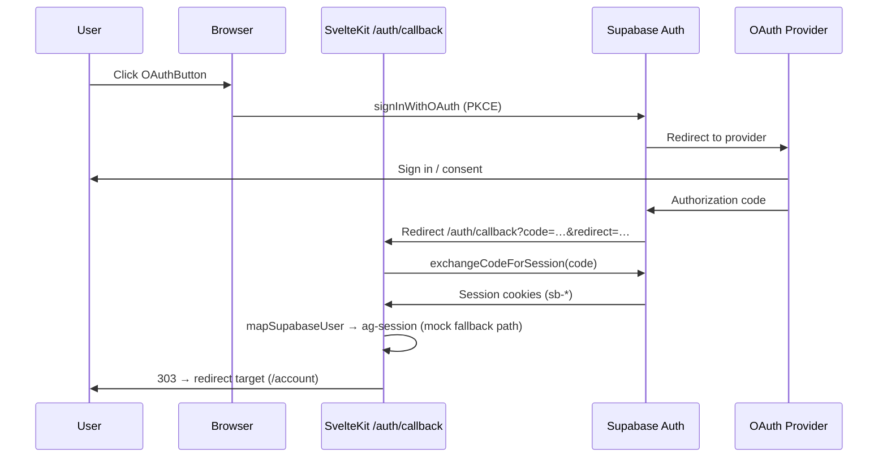

# OAuth / OIDC (Supabase Auth)

Generic OAuth architecture for Animal Garage sign-in. Providers are wired through Supabase Auth with PKCE (SvelteKit + `@supabase/ssr`).

## Provider type

```typescript
// src/lib/auth/oauth.ts
export type OAuthProvider = 'google' | 'discord' | 'azure';
```

| App provider | Supabase Auth provider | Notes |
|--------------|------------------------|-------|
| `google` | `google` | Google OAuth 2.0 / OIDC |
| `discord` | `discord` | Discord OAuth 2.0 |
| `azure` | `azure` | Microsoft Entra ID (OIDC) |

Add new providers by extending `OAuthProvider` and enabling the provider in the Supabase dashboard.

## Code map

| Concern | Location |
|---------|----------|
| Provider types & mock URLs | `src/lib/auth/oauth.ts` |
| Browser `signInWithOAuth` (PKCE) | `src/lib/supabase/auth-client.ts` |
| Server `signInWithOAuth` / `exchangeOAuthCode` | `src/lib/server/supabase/auth.ts` |
| Supabase SSR clients | `src/lib/server/supabase/client.ts`, `src/lib/supabase/browser.ts` |
| OAuth callback | `src/routes/auth/callback/+server.ts` |
| Shared button | `src/lib/components/OAuthButton.svelte` |

## Callback flow



### Mock flow (no env)

When `PUBLIC_SUPABASE_URL` / `PUBLIC_SUPABASE_ANON_KEY` are unset, the browser redirects to:

```
/auth/callback?provider=google&mock=1&redirect=/account
```

The callback sets a JSON `ag-session` cookie via `createMockUser()`. `hooks.server.ts` reads this cookie when Supabase is not configured.

### Live flow (Supabase configured)

1. `signInWithOAuth` in `auth-client.ts` calls `supabase.auth.signInWithOAuth` with `redirectTo` = `{origin}/auth/callback?redirect={target}`.
2. User returns with `?code=…` (PKCE verifier stored in cookies by `@supabase/ssr`).
3. `GET /auth/callback` calls `exchangeOAuthCode` → `exchangeCodeForSession`.
4. Session is stored in Supabase auth cookies; `hooks.server.ts` resolves `event.locals.session` via `getUser()`.

## Supabase dashboard setup

### Redirect URLs

Add these under **Authentication → URL configuration → Redirect URLs**:

| Environment | URL |
|-------------|-----|
| Local dev | `http://localhost:5173/auth/callback` |
| Production | `https://animalgarage.net/auth/callback` |

Also set **Site URL** to your primary origin (e.g. `https://animalgarage.net`).

### Enable providers

**Authentication → Providers** — enable and configure each provider:

| Provider | Dashboard section | Typical credentials |
|----------|-------------------|---------------------|
| Google | Google | OAuth client ID + secret (Google Cloud Console) |
| Discord | Discord | Client ID + secret (Discord Developer Portal) |
| Azure | Azure | Application (client) ID, secret, tenant URL |

For Azure, Supabase uses the `azure` provider ID (Microsoft Entra / OIDC).

### Roles (RBAC)

Store staff roles in `app_metadata.role` (not `user_metadata`). `mapSupabaseUser()` reads `app_metadata.role` and defaults to `customer`.

## OIDC notes

- Supabase Auth acts as the OIDC/OAuth broker — the app never handles provider client secrets in the browser.
- PKCE is enabled by default with `@supabase/ssr` browser clients.
- Provider profile fields land in `user_metadata`; use `oauthDisplayName()` for display names.
- Generic OIDC providers can be added in Supabase as custom SAML/OIDC where supported; map them to a new `OAuthProvider` union member when wired in UI.

## Env vars

```bash
PUBLIC_SUPABASE_URL=https://your-project.supabase.co
PUBLIC_SUPABASE_ANON_KEY=your-anon-key
PUBLIC_SITE_URL=https://animalgarage.net   # fallback callback origin for server routes
```

## Adding a provider button

Use `OAuthButton` with an icon snippet (provider-specific branding lives in the page, not the shared component):

```svelte
<OAuthButton provider="discord" redirectTo={data.redirectTo}>
  {#snippet children()}
    <!-- provider icon -->
  {/snippet}
</OAuthButton>
```
