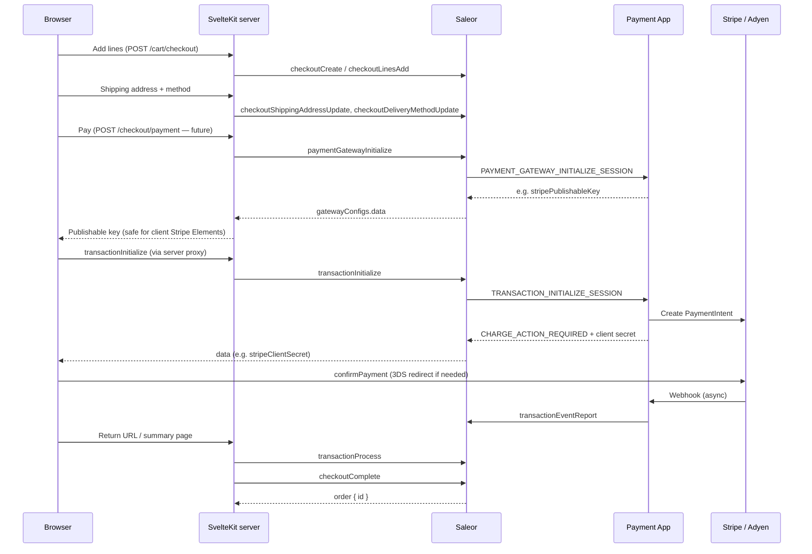

# Saleor payments — headless storefront guide

Public-safe reference for wiring Animal Garage checkout to Saleor Payment Apps and the Transaction API. For catalog and cart scaffolding, see [saleor.md](./saleor.md). For security rules on what may appear in docs, see [SECURITY-PUBLIC.md](../SECURITY-PUBLIC.md).

**Policy:** No production hostnames, bucket names, or credential values in this file. Variable **names** live in [`.env.example`](../../.env.example).

---

## Architecture today (Saleor 3.x)

Saleor recommends **Payment Apps** (Saleor Apps with synchronous transaction webhooks) over legacy **payment plugins**. Plugins expose older mutations such as `checkoutPaymentCreate`; new headless storefronts should use the **Transaction API**.

| Approach | Storefront talks to | Provider secrets live in | Status |
| -------- | ------------------- | ------------------------ | ------ |
| **Payment Apps** (recommended) | Saleor GraphQL only | Saleor Dashboard → installed Payment App (e.g. Stripe App) | Current |
| **Legacy plugins** | Saleor + plugin-specific fields | Saleor plugin settings | Deprecated for new builds |
| **Custom backend** | Your API + `transactionCreate` / `transactionEventReport` | Your server | Advanced; more ownership |

With Payment Apps, the storefront never calls Stripe/Adyen directly for server operations. Saleor mediates via synchronous webhooks (`TRANSACTION_INITIALIZE_SESSION`, `TRANSACTION_PROCESS_SESSION`, etc.) to the installed app.

Official references:

- [Transactions overview](https://docs.saleor.io/developer/payments)
- [Using Payment Apps](https://docs.saleor.io/developer/payments/payment-apps)
- [Transactions API](https://docs.saleor.io/developer/payments/transactions)
- [Checkout cookbook](https://docs.saleor.io/developer/checkout/cookbook)
- [Stripe App — storefront integration](https://docs.saleor.io/developer/app-store/apps/stripe/storefront-integration)
- [Building a Payment App](https://docs.saleor.io/developer/extending/apps/building-payment-app)

---

## End-to-end checkout flow

Default Saleor flow: **pay first, then create order** (`allowUnpaidOrders` off). Order is created by `checkoutComplete` after the checkout total is covered by successful transactions.

**Saleor recommendation:** Run `transactionInitialize` and `transactionProcess` from the **server** (SvelteKit `+server.ts` / form actions), not directly from browser GraphQL, for resilience and to keep idempotency keys server-side. Client-side Stripe Elements / Adyen Drop-in is fine for card UI only.

### Mutation sequence (Transaction API + Payment Apps)

| Step | Mutation | Purpose |
| ---- | -------- | ------- |
| 1 | `checkoutLinesAdd` | Cart lines (wired) |
| 2 | `checkoutShippingAddressUpdate` | Address → `availableShippingMethods` |
| 3 | `checkoutDeliveryMethodUpdate` | Selected shipping rate |
| 4 | `paymentGatewayInitialize` | Fetch gateway config (e.g. Stripe publishable key) |
| 5 | `transactionInitialize` | Start payment; creates `Transaction` on checkout |
| 6 | `transactionProcess` | After 3DS / redirect; sync status from provider |
| 7 | `checkoutComplete` | Create `Order` when payment covers total |

Event types on `transactionEvent.type` drive UI: `CHARGE_ACTION_REQUIRED` / `AUTHORIZATION_ACTION_REQUIRED` → show 3DS or redirect; `CHARGE_SUCCESS` / `AUTHORIZATION_SUCCESS` → proceed to complete.

### Channel payment settings (Saleor Dashboard)

Configure per channel, not in the storefront:

- **Payment apps** — install Stripe (manifest id `saleor.app.payment.stripe`) or Adyen app; enable for channel
- **`defaultTransactionFlowStrategy`** — charge vs authorize
- **`allowUnpaidOrders`** — if false (default), `checkoutComplete` fails until transactions cover total
- **`automaticCompletion`** — optional auto-`checkoutComplete` when fully paid (Payment Apps only; not compatible with legacy Stripe plugin)

`checkout.availablePaymentGateways` lists apps subscribed to `TRANSACTION_INITIALIZE_SESSION` with active webhooks.

### Webhooks — who receives what

| Webhook direction | Endpoint | Secret location |
| ----------------- | -------- | --------------- |
| PSP → Payment App (e.g. Stripe → Saleor Stripe App) | Configured in Payment App / Saleor Cloud | Payment App env in Saleor — **not** storefront |
| Saleor → your storefront (optional: `ORDER_CREATED`, fulfillment) | `POST /api/webhooks/saleor` | `SALEOR_WEBHOOK_SECRET` (server-only) |

Animal Garage does not need PSP webhook endpoints on Netlify unless you build a custom Payment App.

---

## Environment variables

See [`.env.example`](../../.env.example). Summary:

### Public (browser-safe)

| Variable | Role |
| -------- | ---- |
| `PUBLIC_SALEOR_API_URL` | Saleor GraphQL endpoint — used for catalog reads; checkout mutations should be **proxied** through SvelteKit |

### Server-only (Netlify: scoped to builds + functions, never `PUBLIC_`)

| Variable | Required for payments | Role |
| -------- | --------------------- | ---- |
| `SALEOR_CHANNEL` | Yes | Channel slug; must match dashboard channel with payment app enabled |
| `SALEOR_APP_TOKEN` | Optional | Bearer token if your Saleor instance requires app auth for checkout mutations |
| `SALEOR_WEBHOOK_SECRET` | Optional | Verify `Saleor-Signature` on incoming Saleor webhooks to `/api/webhooks/saleor` |

### Must **not** appear in storefront env

| Secret | Where it belongs |
| ------ | ---------------- |
| Stripe **secret** key, webhook signing secret | Saleor Stripe Payment App configuration |
| Adyen API key, HMAC key | Saleor Adyen Payment App configuration |
| Payment App manifest signing secret | Saleor App deployment |
| `SALEOR_APP_TOKEN` (if used) | Server-only — never `PUBLIC_*` |

Stripe **publishable** key is returned by `paymentGatewayInitialize` at runtime — do not hardcode in `.env` unless you have a single-gateway static setup (not recommended).

---

## Secrets handling checklist

- [ ] All payment mutations run in `src/lib/server/saleor/*` or `src/routes/**/+server.ts` — never import provider SDKs with secrets in client components
- [ ] `ag-checkout-id` stays **httpOnly** (already implemented)
- [ ] Netlify env: `SALEOR_*` without `PUBLIC_` prefix; audit deploy logs for leakage
- [ ] Run `bash scripts/check-secrets.sh` before push; ensure client bundle has no `SERVICE_ROLE` / secret key strings
- [ ] Provider keys only in Saleor Dashboard → Apps → Payment app settings
- [ ] Document ops runbook (private) for rotating Stripe/Adyen keys in Saleor — not in git
- [ ] Webhook stub verifies signature when `SALEOR_WEBHOOK_SECRET` is set

---

## Stripe headless pattern (SvelteKit)

Saleor’s Stripe App uses manifest id `saleor.app.payment.stripe`. Storefront steps (adapted from [official guide](https://docs.saleor.io/developer/app-store/apps/stripe/storefront-integration)):

1. **Server:** `paymentGatewayInitialize` with `paymentGateways: [{ id: "saleor.app.payment.stripe" }]` → read `stripePublishableKey` from `gatewayConfigs[0].data`
2. **Client:** Load `@stripe/stripe-js` with publishable key; render Payment Element (no secret key in browser)
3. **Server:** `transactionInitialize` with `paymentGateway.data` from Stripe `elements.submit()` (payment method payload)
4. **Client:** `stripe.confirmPayment({ clientSecret, return_url })` using `data.stripeClientSecret` from mutation response
5. **Return URL** (e.g. `/checkout/complete`): **server** runs `transactionProcess` then `checkoutComplete`
6. Use **idempotency keys** on `transactionInitialize` (UUID in server session or persistent storage per checkout)

For Svelte (not React), use `@stripe/stripe-js` directly instead of `@stripe/react-stripe-js`.

---

## Implementation phases (aligned with AUDIT-REMEDIATION)

| Phase | AUDIT ID | Work | Owner |
| ----- | -------- | ---- | ----- |
| **P0** | AUD-P0-004 | `PUBLIC_SALEOR_API_URL` + `SALEOR_CHANNEL` on Netlify; payment app installed on channel | ops |
| **P1** | AUD-P1-001 | Shipping address/method mutations; payment proxy routes; `/checkout` UI; `checkoutComplete` | saleor / code |
| **P1** | AUD-P1-002 | Cart line PATCH/DELETE (largely wired — verify E2E) | saleor |
| **P2** | — | `/api/webhooks/saleor` handlers for `ORDER_CREATED` (email, analytics) | code |
| **P2** | — | Automatic checkout completion channel setting + storefront handling deleted checkout | code |

See [AUDIT-REMEDIATION.md](../plans/AUDIT-REMEDIATION.md) and [inspiration-polish-prod-setup.md](../plans/active/inspiration-polish-prod-setup.md) Phase 2.

---

## Codebase status (Animal Garage)

| Area | File | Status |
| ---- | ---- | ------ |
| Checkout create / add / update / delete lines | `checkout.ts`, `cart/checkout/+server.ts` | Wired |
| Promo codes | `checkout.ts`, `cart/checkout/promo/+server.ts` | Wired |
| Shipping address / methods | `checkout-queries.ts` | Scaffold commented (`@saleor-migration`) |
| Payment gateway init / transactions | `checkout-queries.ts`, `checkout.ts` | Scaffold commented |
| `checkoutComplete` | `checkout-queries.ts`, `checkout.ts` | Scaffold commented |
| Checkout UI | `src/routes/checkout/+page.svelte` | Placeholder |
| Saleor webhooks | `src/routes/api/webhooks/saleor/+server.ts` | Stub (501 until wired) |
| GraphQL client auth | `client.ts` | No `SALEOR_APP_TOKEN` header yet |

Uncomment `@saleor-migration` blocks when implementing each step — do not delete during polish sweeps.

---

## Suggested API routes (future)

| Route | Method | Role |
| ----- | ------ | ---- |
| `/cart/checkout` | POST/PATCH/DELETE | Lines (exists) |
| `/checkout/shipping` | POST | Address + delivery method update |
| `/checkout/payment/initialize` | POST | `paymentGatewayInitialize` + `transactionInitialize` |
| `/checkout/payment/process` | POST | `transactionProcess` |
| `/checkout/complete` | POST | `checkoutComplete` + clear `ag-checkout-id` |
| `/api/webhooks/saleor` | POST | Optional Saleor → storefront events |

---

## Testing

1. Install Stripe Payment App on staging Saleor channel
2. Set `PUBLIC_SALEOR_API_URL` and `SALEOR_CHANNEL` locally
3. `npm run test:readiness` — `saleor-checkout` probe
4. Manual: add line → set shipping → pay test card → order in Saleor Dashboard
5. `bash scripts/check-secrets.sh` before commit
