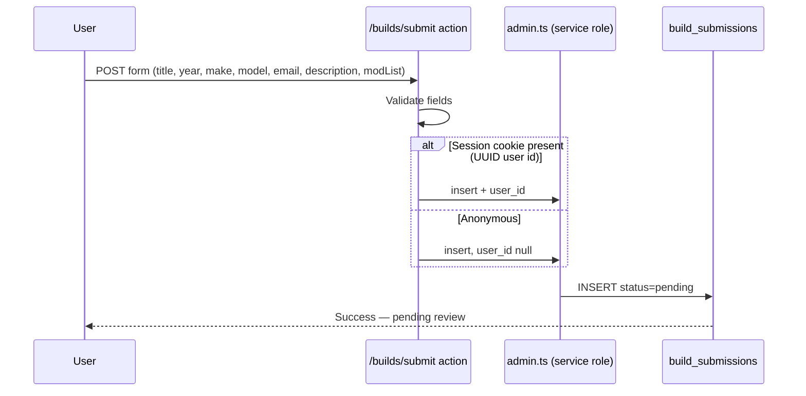

# Build submissions

User-submitted build logs from [`/builds/submit`](../../src/routes/builds/submit/) are stored in Supabase for moderation before appearing on the public builds gallery.

## Flow

### Mock fallback

When `PUBLIC_SUPABASE_URL`, `PUBLIC_SUPABASE_ANON_KEY`, or `SUPABASE_SERVICE_ROLE_KEY` are unset, the action returns success without persisting (same UX copy). Local dev and CI work without a Supabase project.

### Authenticated submitters

If `event.locals.session` exists and `session.id` is a valid UUID (real Supabase auth), it is stored as `user_id`. Mock session ids (`mock-*`) are ignored to avoid FK violations.

## Schema

Migration: [`supabase/migrations/20250629120000_build_submissions.sql`](../../supabase/migrations/20250629120000_build_submissions.sql)

| Column        | Type        | Notes                                      |
| ------------- | ----------- | ------------------------------------------ |
| `id`          | uuid        | Primary key                                |
| `created_at`  | timestamptz | Default `now()`                            |
| `user_id`     | uuid (null) | FK → `auth.users`, set null on user delete |
| `title`       | text        | Build name                                 |
| `year`        | smallint    | 1900–2099                                  |
| `make`        | text        |                                            |
| `model`       | text        |                                            |
| `email`       | text        | Contact for approval / rejection           |
| `description` | text        |                                            |
| `mod_list`    | text        | Free-text mod list                         |
| `status`      | text        | `pending` \| `approved` \| `rejected`      |
| `slug`        | text (null) | Set when published to public builds        |

## RLS

- **INSERT:** `anon` and `authenticated` — public form submissions (email required in app validation).
- **SELECT:** No policy for anon/authenticated. Submissions are not publicly readable.
- **Moderation reads:** Use `SUPABASE_SERVICE_ROLE_KEY` via [`src/lib/server/supabase/admin.ts`](../../src/lib/server/supabase/admin.ts) (bypasses RLS). Future admin UI should add a role-based SELECT policy instead of exposing the service key to browsers.

Server writes use the service role so inserts succeed regardless of caller RLS; the INSERT policy documents intent if direct client inserts are added later.

## Moderation

1. List rows where `status = 'pending'` (service role or future admin API).
2. Review content; set `status` to `approved` or `rejected`.
3. Optionally email the submitter at `email` (not implemented yet).

Rejected rows stay in the table for audit; they are never shown on `/builds`.

## Future: publish to builds

Approved submissions should become public [`BuildThread`](../../src/lib/types/domain.ts) entries:

1. Generate unique `slug` from title (e.g. `project-redline-civic`).
2. Set `status = 'approved'` and persist `slug` on the submission row.
3. Create or sync a row in a `builds` table (or continue mock → CMS migration path documented in [mock-to-saleor.md](../style-guide/business-logic/mock-to-saleor.md)).
4. Award garage XP to `user_id` when present (see loyalty flow).
5. Invalidate or revalidate `/builds` cache.

Until that pipeline exists, [`src/lib/data/mock/builds.ts`](../../src/lib/data/mock/builds.ts) remains the source for the public builds gallery.

## Related code

| File | Role |
| ---- | ---- |
| `src/routes/builds/submit/+page.server.ts` | Validation + action |
| `src/lib/server/forms/submit.ts` | Insert + mock fallback |
| `src/lib/server/supabase/admin.ts` | Service-role client |
