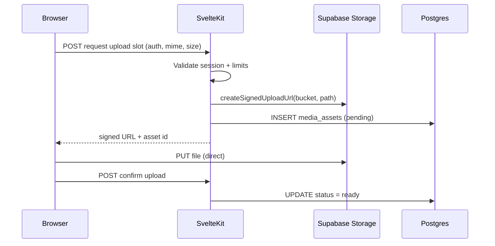

**Status:** Partial — Phase 1 API + migration wired; apply migration + bucket on Supabase project; Phase 2 review form started

# Media uploads plan

User-generated media for reviews (testimonials), build logs, and admin `/admin/media`. v1 uses **Supabase Storage** in the same project as auth; migrate to S3 + CloudFront when CDN traffic grows.

## Current state

| Area | Status |
|------|--------|
| `/admin/media` | Prototype UI — no real upload |
| `testimonials` table | Text + `testimonial_media` join (migration `20250630120000_media_assets.sql`) |
| `/api/media/upload-slot`, `/confirm`, `/[id]` | **Done** — requires migration applied + `ugc` bucket |
| Review photo upload UI | **Partial** — `ReviewPhotoUpload.svelte` + loyalty form wiring |
| `.env.example` | S3 + CloudFront vars stubbed for future CDN |

## Setup (blocked until applied)

1. Run `supabase db push` (or apply `20250630120000_media_assets.sql`) on the production project.
2. Confirm Storage bucket `ugc` exists (migration inserts it) with 5 MB / image mime limits.
3. Netlify must have all three Supabase env vars set (upload endpoints return 503 without them).

## Architecture (v1)



**Decisions**

- **Storage backend:** Supabase Storage bucket `ugc` (private); public reads via signed URLs or approved testimonial join only.
- **Upload flow:** Server-minted signed upload URL — client `fetch` PUT (no Uppy until multi-file/progress needed).
- **Validation:** Images only (`image/jpeg`, `image/png`, `image/webp`), max 5 MB per file, max 4 files per testimonial.
- **Moderation:** Media linked to testimonial stays hidden until testimonial `status = 'approved'`.
- **Auth:** Authenticated users upload to namespaced paths `ugc/{user_id}/{asset_id}.{ext}`; RLS on `media_assets` + bucket policies.

## Schema sketch (Phase 1 migration)

```sql
-- Bucket (dashboard or migration): ugc, private, 5MB limit, image mime types

create table public.media_assets (
  id uuid primary key default gen_random_uuid(),
  created_at timestamptz not null default now(),
  user_id uuid not null references auth.users (id) on delete cascade,
  bucket text not null default 'ugc',
  storage_path text not null unique,
  mime_type text not null,
  byte_size integer not null check (byte_size > 0 and byte_size <= 5242880),
  status text not null default 'pending'
    check (status in ('pending', 'ready', 'rejected')),
  width integer,
  height integer
);

create table public.testimonial_media (
  testimonial_id uuid not null references public.testimonials (id) on delete cascade,
  media_asset_id uuid not null references public.media_assets (id) on delete cascade,
  sort_order smallint not null default 0,
  primary key (testimonial_id, media_asset_id)
);

alter table public.media_assets enable row level security;
alter table public.testimonial_media enable row level security;

-- Users CRUD own assets; public read only via approved testimonials (policy TBD in Phase 1)
```

Alternative considered: `testimonials.media_urls jsonb` — rejected for v1; join table keeps moderation and CDN path changes cleaner.

## Phases

| Phase | Deliverable |
|-------|-------------|
| **0** | This plan + schema sketch |
| **1** | Supabase bucket `ugc`, RLS, `media_assets` table, `POST /api/media/upload-slot` (signed URL), confirm endpoint |
| **2** | Review submit form: file input, gallery on approved testimonial cards |
| **3** | `/admin/media` wired to real storage list/delete; orphan cleanup job |

## Server endpoints (Phase 1)

| Route | Purpose |
|-------|---------|
| `POST /api/media/upload-slot` | Auth check, mime/size, create row + `createSignedUploadUrl` |
| `POST /api/media/confirm` | Verify object exists in bucket, set `status = ready` |
| `DELETE /api/media/[id]` | Owner or admin delete |

Use `createAdminClient()` only for moderation overrides; normal writes use user-scoped Supabase client + RLS.

## Client (Phase 2)

- Native `<input type="file" accept="image/*">` + `fetch` PUT to signed URL.
- Progress: optional `XMLHttpRequest` or wait for Uppy if UX needs it.
- Display: `` on approved cards only.

## Security

- Never expose `SUPABASE_SERVICE_ROLE_KEY` to the browser.
- Signed URLs short TTL (e.g. 60s upload, 1h read for approved content).
- Virus scan: defer to Phase 3+ (ClamAV or provider hook).

## Future: S3 + CloudFront

When edge traffic justifies it, mirror [archive/media-cdn-plan.md](../../archive/media-cdn-plan.md): same `media_assets.storage_path` convention, swap presign implementation to S3, keep DB schema.

## Related docs

- [archive/media-cdn-plan.md](../../archive/media-cdn-plan.md) — long-term CDN / Garage origin
- [integrations/supabase.md](../../integrations/supabase.md) — auth and service role usage
- `.cursor/agents/media-uploads.md` — agent spec for implementation
- `.env.example` — `PUBLIC_CDN_BASE_URL`, S3 vars
